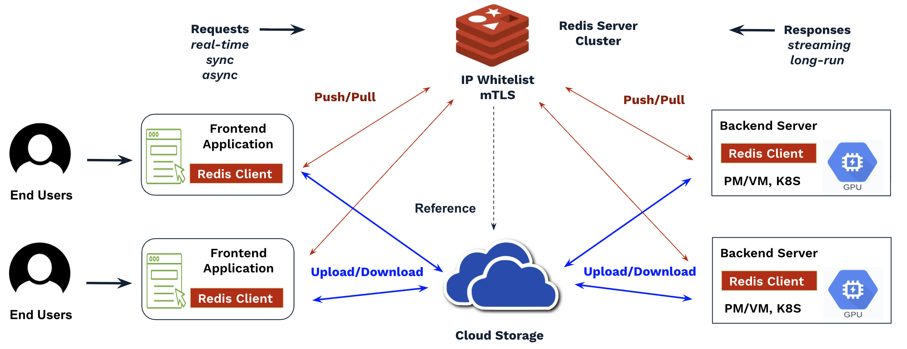
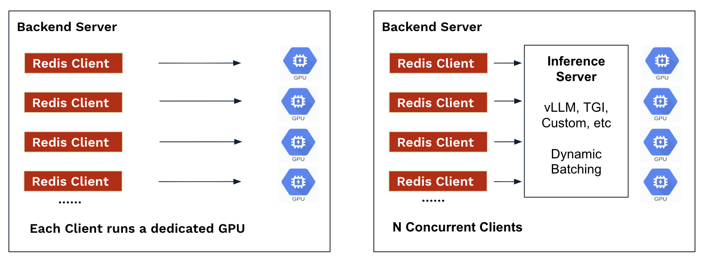
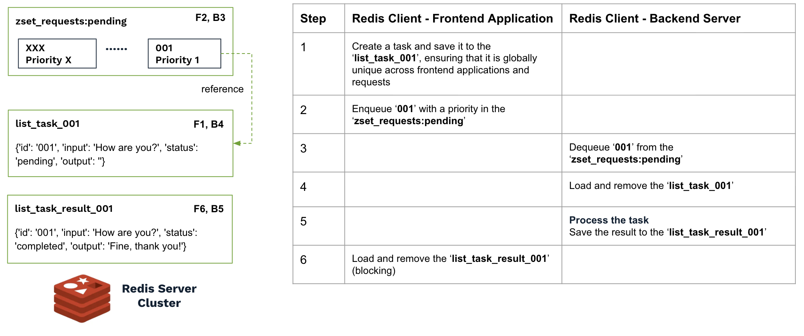
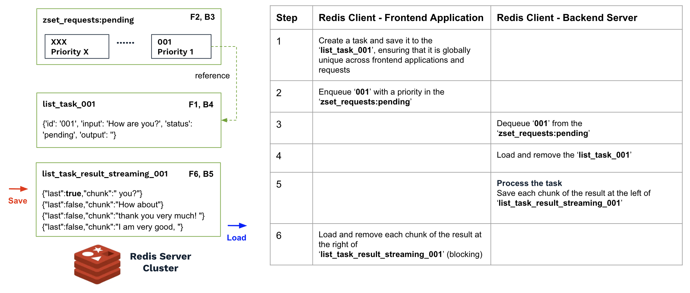
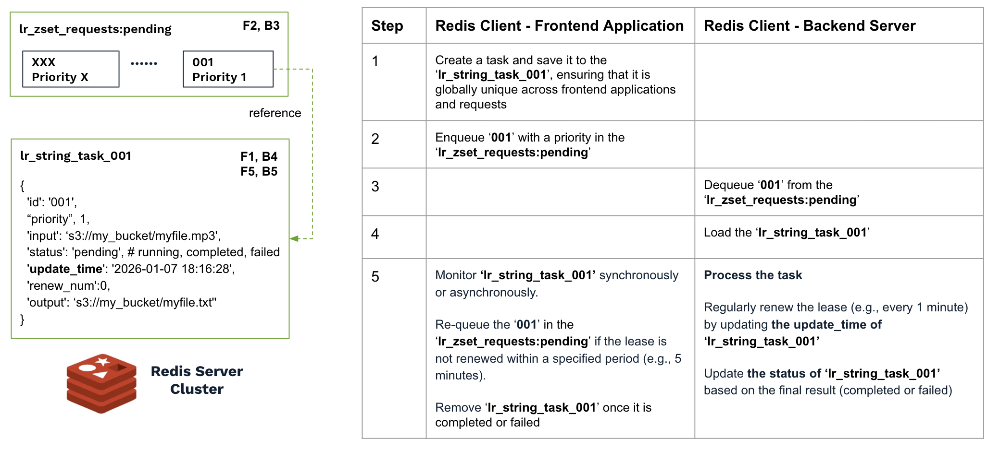

# Redis Queue for AI Inference

This repository offers a flexible solution for building a job queue with either a managed or self-hosted Redis server. It supports a wide range of AI inference workloads—including real-time and synchronous, streaming, asynchronous, and batch jobs—and a variety of use cases such as image and video generation, large language models (LLMs), transcription (Speech-to-Text, STT) and Text-to-Speech (TTS), rendering, molecular dynamics simulations, and more.

## Real-Time Inference and Batch Jobs

Unlike traditional web applications, which typically have predictable request–response times, AI inference workloads often exhibit longer and more variable latencies. Factors influencing latency include image size, video frame count, context length in LLMs, audio duration, or the number of simulation steps.

As a practical guideline, we can use `100` seconds as a boundary, reflecting the maximum server response timeout enforced by many load balancers and public services, including [Cloudflare](https://community.cloudflare.com/t/increase-cloudflare-max-request-duration/482873).

- **Synchronous / Real-Time Inference (≤100 seconds)** Workloads such as image generation, LLM inference (e.g., time to first token in streaming), and speech processing tasks like STT and TTS typically fall into this category. This model is often implemented by placing a load balancer(LB) in front of a pool of inference servers, with client applications or end users waiting for the results after submitting requests. In practice, if the client or frontend applications (UI, task producer) and backend servers (AI inference, task consumers) are hosted across different cloud providers, a VPN or tunnel (self-managed or managed, such as [Tailscale](https://tailscale.com/), [Cloudflare Tunnel](https://developers.cloudflare.com/cloudflare-one/networks/connectors/cloudflare-tunnel/)) or a dedicated network connection is often used to securely connect them.

- **Asynchronous / Batch Inference (>100 seconds)** Workloads with longer runtimes—such as video generation, batch LLM inference, rendering, or molecular dynamics simulations (MDS)—typically require an asynchronous architecture. In this model, frontend applications submit jobs to a queue (e.g., [AWS SQS](https://aws.amazon.com/sqs/), [GCP Pub/Sub](https://cloud.google.com/pubsub), or similar services) and later either poll for results or receive callbacks when the jobs are completed. The workloads usually integrate with the job queue, pulling jobs, processing them, and returning results. For very long-running jobs, such as molecular dynamics simulations, which may take hours or even days, state management using cloud storage is essential. It allows tracking of job status, intermediate artifacts, and final results—similar to saving checkpoints for each epoch in AI model training—helping to prevent interruptions and data loss. 

Many successful AI solutions and applications have already been built using either approach:

**LB-based solutions** are typically tied to specific cloud providers—using ALB or NLB, public or private, and may depend on whether Kubernetes is in use. While these solutions can perform well initially for real-time applications, they require careful service planning and configuration optimization as user traffic grows. For more details, see [Load Balancer for AI Inference](https://github.com/rxsalad/load-balancer-ai-inference). To simplify security and traffic management on the LB endpoints, see [Tunnels for AI Inference](https://github.com/rxsalad/tunnels-for-ai-inference).

**Queue-based solutions**, by contrast, simplify the decoupling of frontend and backend applications and help manage system load through features like autoscaling, task prioritization, retry mechanisms, and load balancing across workers. However, they are constrained by the limitations of the chosen queue service, including maximum message size, retention period, and visibility timeout, etc.

## Solution Architecture

A custom Redis-based queue (RQ) combines the advantages of both LB and queue-based architectures while supporting multiple application types—real-time and synchronous, streaming, asynchronous, and batch jobs. It can also be easily tailored to meet specific requirements. **Based on real project experience, building and optimizing a Redis Queue for a specific use case can usually be completed within a week.**

**Note: If the goal is to provide public, standard APIs for end users or partners, the LB–based solution is still preferred.**

- The Redis server cluster, frontend applications, and backend servers are all deployed within the same region to ensure low-latency access. However, they can be hosted across different cloud providers to optimize costs and leverage the best available offerings.

- The Redis cluster can be managed or self-hosted and may be publicly accessible (secured with IP Whitelist and mTLS) or kept private. It should support high availability (HA) and, optionally, data backup based on the scenario. Many managed Redis services from public cloud providers offer these features.

- Task input and output data can be included directly within the requests and responses, which are exchanged via the Redis cluster between frontend applications and backend servers. For larger datasets, the data can be stored in cloud storage, with requests and responses containing only references to the data.

- Each backend server—whether running on physical machines, virtual machines, or containers—can run multiple Redis client instances and process multiple tasks concurrently. Each client instance can either use a dedicated GPU (for STT and TTS use cases) or connect to a local dedicated inference server (e.g., vLLM), which utilizes all GPUs and supports concurrent access and batched inference. 

- While backend servers continuously pull and process new jobs from the queue based on their available capacity, traffic management and autoscaling are primarily handled by the frontend applications or by dedicated tools such as [KEDA](https://keda.sh/docs/2.18/scalers/redis-lists/) in Kubernetes. By monitoring both application-level metrics and Redis metrics—such as the number of pending jobs—these applications or tools can automatically scale backend servers and, if necessary, reject requests from end users to maintain system stability.

- For long-running tasks that may fail or be interrupted, the queue should provide a built-in retry mechanism, such as lease renewal and re-queuing. 

Before diving into the details of various scenarios, set up a self-managed Redis server with mTLS by following [the setup guide](README-MTLS.md), and familiarize yourself with the basic Redis data types and programmatic access using [the programming guide](README-PA.md).

## Reference Desgin: Synchronous and Asynchronous

Please refer to the example code ([frontend sync](V1/rq_nonstreaming_client_sync.py), [frontend async](V1/rq_nonstreaming_client_async.py) and [backend](V1/rq_nonstreaming_server.py)) in this senario.

In this solution, the frontend creates a task, assigns it a globally unique ID (e.g., `001`), and saves it to a list (e.g., `list_task_001`). The task ID (`001`) is then enqueued into the zset `lr_zset_requests:pending`. The frontend can then load the list `list_task_result_001` synchronously (blocking, with a timeout) based on the pre-defined logic—for example, `list_task_result_001` contains the result corresponding to `list_task_001`. Alternatively, the frontend can perform other operations before checking the result, allowing for asynchronous execution. The backend dequeues the ID (e.g., `001`) and loads the corresponding list `list_task_001`. After prcessing the task, it saves the result to `list_task_result_001` based on the pre-defined logic.

Because both  `list_task_001` and `list_task_result_001` contain only a single item, they will be automatcally removed once the item is popped.

Task input and output data can be stored directly within `list_task_001` and `list_task_result_001`. For larger datasets, it is more efficient to use cloud storage, which provides more tools to optimize I/O performance and throughput. In such cases, `list_task_001` and `list_task_result_001` contain only references to the data.

By monitoring the number of task IDs in the zset `lr_zset_requests:pending`—either through frontend applications or a dedicated tool (e.g., KEDA)—we can implement autoscaling and/or flow control on the frontend, proactively rejecting new requests from end users when necessary.

For real-time applications, such as STT and TTS, it is generally unnecessary to implement a retry mechanism within the queue. Requests that fail or time out can be dropped immediately. Additionally, TTLs (time-to-live) can be set so that overdue requests and results—no longer valid—are automatically removed from the system.

This approach has been successfully adopted by customers for real-time transcription use cases, where the frontend sends audio chunks to the backend and receives transcripts with subsecond latency. The audio chunks can either be transmitted directly via the Redis server or stored in cloud storage, with the Redis server transferring only references to the data. 

## Reference Desgin: Streaming

Please refer to the example code ([streaming frontend](V1/rq_streaming_client.py) and [streaming backend](V1/rq_streaming_server.py)) in this senario.

This solution is similar to the previous scenario but differs mainly in how task results are generated by the backend and delivered to the frontend. Instead of transferring the entire result at once using a list with a single item, the backend appends result chunks to the left of the list `list_task_result_streaming_001` as they are generated, while the frontend reads chunks from the right. The final chunk is tagged to indicate completion and allow the frontend to stop reading.

This approach has been successfully adopted by customers for LLM use cases, where each chunk contains a small number of tokens generated by the inference server (e.g., vLLM) and streamed back to the frontend via the Redis server and clients. It may also be applied to video generation or rendering, allowing each frame to be returned immediately as it is generated, even if the full process takes a long time, thereby improving the user experience.

## Reference Desgin: Batch Jobs

Please refer to the example code ([long run frontend](V1-LONG-RUN/rq_lr_client.py), [frontend task monitor](V1-LONG-RUN/rq_lr_client_tasks_monitoring.py) and [long run backend](V1-LONG-RUN/rq_lr_server.py)) in this senario.

Batch jobs typically run for longer durations, and if a job fails due to errors—such as server failures, application errors, or network issues—a retry mechanism is required to re-queue the job and allow another backend server to process it.

In this solution, we use a string (e.g., `lr_string_task_001`) to track a task's excution, which is shared and accessed by both the frontend and backend. The task string stores only metadata, while the task input and output data are maintained in cloud storage.

The backend runs a background thread to periodically update the `update_time` field in the task string (e.g., every `1` minute) while processing the task in its main thread. The frontend can monitor the task either synchronously or asynchronously. If the update_time is not refreshed within a specified period (e.g., `5` minutes), it indicates that the server processing the task has failed, and the frontend can re-queue the task ID (`001`) into the zset `lr_zset_requests:pending` with its previous priority, allowing it to be processed first.

Additional fields can be added to the task string, such as the maximum number of retries, which defines how many interruptions are allowed during task execution, including application or infrastructure errors. Fields can also be included to track how many backend servers have processed the task and to record their execution times.

To avoid restarting an unfinished task from scratch after an interruption, the backend server should also implement task state management:
- Start fresh while pulling a new task.
- Regularly save and upload the running state—such as checkpoints, steps, or trajectories—to cloud storage during execution.
- Download and resume from the previous running state if retrieving an unfinished task.

The above design aims to build a highly reliable queue service along with task state management for long running tasks. A simpler approach is to track each job’s execution using a unique state file in cloud storage instead of storing it in Redis. The backend updates the file periodically, while the frontend monitors it and triggers a re-queue if an error occurs. This approach can reduce the load on the Redis server and lessen the reliance on high availability and data backup, though its effectiveness will need to be validated through real-world project implementation.